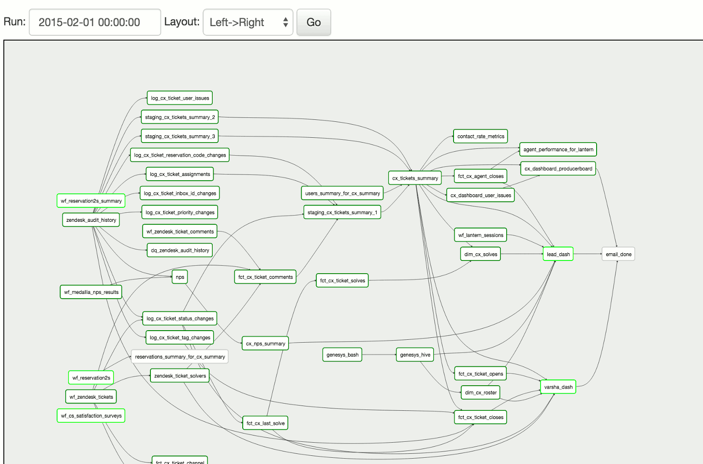
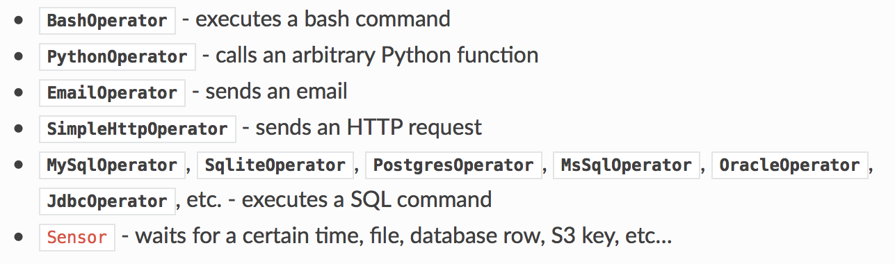
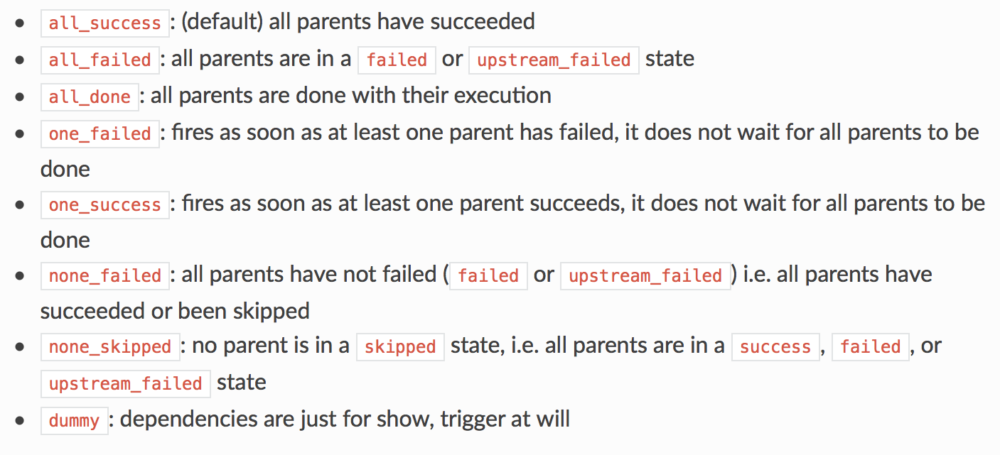
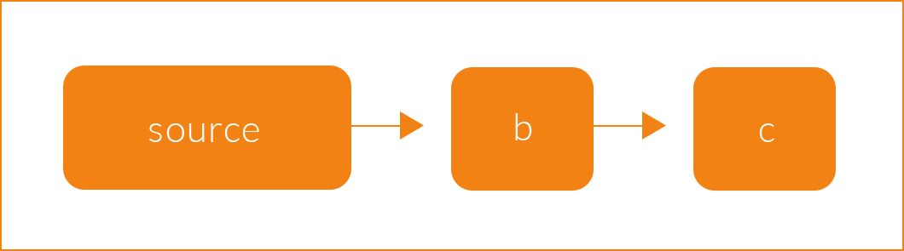
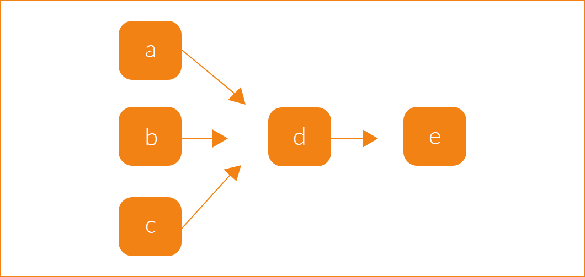
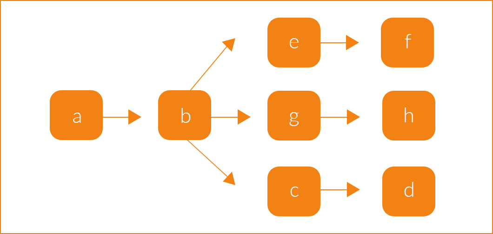

# Apache Airflow Lunch & Learn

 
     

## What is Apache Airflow?

> Airflow is a framework to programmatically author, schedule and monitor workflows.

Open Source workflow management system in use at Airbnb, Google, Lyft, PayPal, Reddit, Intel, Square, Walmart and Twitter, among others.

A workflow, in general terms, is simply a sequence of tasks or processes, commonly executed in regular schedules. In data applications, workflows can be data warehousing procedures, computing timed metrics, A/B testing, and more. 

Airflow *is not* a data streaming solution. Workflows are expected to be mostly static (perform the same procedures every time). Airflow is a good solution to automate batch processes.

Airflow was created by Maxime Beauchemin at Airbnb in 2014. The project joined the Apache Software Foundation's Incubator program in 2016 and was announced as an Apache Top-Level Project (TLP) in Jan 2019.
 
## Airflow paradigm
Airflow is written in Python from the ground up. Airflow has a selling point of "configuration as code". As long as you can run Python, you will be able to author and execute Airflow workflows. This is a huge advantage if you already use a Python stack. 

This is opposed to other workflow management frameworks where your task logic is implemented in code but scheduling and configuration is separate. 

With many ETL/workflow/scheduler tools you'd likely have to build XML or JSON config files and then learn the tool-specific skills to use it. For example, `cron` is OS specific to unix-like systems (not available on Windows), and many proprietary software (Alteryx, Tableau, Informatica) requires you to learn exactly how to their tool, which also may not be available everywhere you want to run your workflow. In contrast, to use Airflow, you would need to learn their programming model.

**Directed Acyclic Graphs (DAGS)**

Workflows are created as DAGs. Every workflow you implement is a separate DAG. Nodes are tasks and edges are directed dependencies. 

 
    

We implement tasks as standalone, loosely-coupled, idempotent pieces of code. Each task does something specific. Then we define the dependencies of tasks. Airflow abstracts task implementation using objects called Operators. Tasks are simply instances of Operators. These are the building blocks of Airflow workflows.

So while DAGs describe *how* to run a workflow, **Operators** define what is actually done.

Some example Operators:

 
	 

Additional functionality (there is much more than these two):

- **Hooks**

    Hooks are interfaces to external platforms and databases like Hive, S3, MySQL, Postgres, HDFS, and Pig. Hooks implement a common interface when possible, and act as a building block for operators. Hooks keep authentication code and information out of pipelines, centralized in the metadata database.

    Hooks are also very useful on their own to use in Python scripts, and in interactive environments like Jupyter Notebooks.

- **Sensors** (a type of Operator)

    Sensor are long running tasks that have a *poke* method. Sensors repeatedly call poke every defined time interval until a condition returns True. Sensors are useful for monitoring external processes, or checking for the availability of a resource (data). Eg. In Amazon S3, you can poke until a specific key is found

Airflow is highly extensible. In addition to what is available out-of-the-box, you can extend the base classes to implement your own. As you create more Operators, Sensors, Hooks, and more, you will have a toolbox of these building blocks that are reusable for any other DAG you want to create.

## Dependency Management. 
One of the selling points of Airflow is being able to concisely define dependencies between tasks.

**Trigger Rules**:

Trigger rules determine when a task is executed. The default behaviour is to run a task when all directly upstream tasks have succeeded, but more complex dependency settings are available.

 
	 

Airflow also has a feature called **XCOM** (Cross Communication), which allows communication between tasks. This can be useful for dynamic tasks where the output is variable and proceeding tasks depend on the outcome of that task.

## Alerting (Task Fails & Service Level Agreements)

Alerts can be delivered by email or Slack when tasks fail or Service Level Agreements are not reached.

## Examples

*Refer to code and UI*

## Backfill and Catchup

Another optional feature of Airflow is called Backfill. As we saw in the code, when DAGs are defined, we provide a `start_date`, possibly an `end_date`, and a `schedule interval`. Eg. if we have a daily DAG starting on 2019-01-01 and it ends on 2019-02-01, then the DAG will run 31 times, and hence we have 31 intervals. 

The scheduler will kick off a DAG Run for any interval that has not yet been run. So if this DAG were picked up on 2019-01-10, it would first backfill the first 10 days of January and kick off 10 DAG Runs even though that time has already passed. 

You can turn Catchup on and off depending on your use case and if you need it.

## Common Workflow patterns

**Sequential source to destination pattern**

> In this pattern, you have a sequence of tasks being executed in order. For example, `source` is file on FTP, `b` is some transform or join with data from the database and `c` is target destination.

 
     

**Tributaries pattern**

> This is a pattern where multiple data streams/sources are combined together. 

 
     

**Distributaries pattern**

> This pattern is opposite to the the one above, it is used to push data to multiple branches from a single source.

 
     

From: https://medium.com/snaptravel/airflow-part-2-lessons-learned-793fa3c0841e

## Internals/Under the hood

1. **Metadata Database**

    Airflow uses a database to keep track of state, DAGs, tasks, database connections, users, etc. The default database is a lightweight, local SQLite database instance for testing but you should set up a production level database for anything more than testing. Any SQLalchemy supported database works but Postgres and MySQL are recommended.

2. **Workers**

    Workers are on physical machines that actually execute the code in tasks. You can run tasks in parallel on one machine and for scalability, can even set up a cluster of workers with a distributed task queue.

1. **Scheduler**
	
	The scheduler reads from the metadata database and checks the status of tasks and decides what needs to be done and in what order. The scheduler has a "heartbeat", and at each heartbeat it loads all the DAGs again to run. The default value is a heartbeat every 5 seconds and any new development changes will be picked up.

1. **Executor**

    Executors are the messaging queues that send tasks to workers to be executed. 

    There are 3 main executors:

    - SequentialExecutor (default)

        > This executor will only run one task instance at a time, can be used for debugging. It is also the only executor that can be used with sqlite since sqlite doesn’t support multiple connections.

    - LocalExecutor

        > LocalExecutor executes tasks locally in parallel. It uses the multiprocessing Python library and queues to parallelize the execution of tasks.

    - CeleryExecutor

        > CeleryExecutor is recommended for production use of Airflow. It allows distributing the execution of task instances to multiple worker nodes.

        > Celery is a distributed system to process vast amounts of messages, while providing operations with the tools required to maintain such a system.

*Refer to <a href="https://github.com/apache/airflow/blob/master/airflow/config_templates/default_airflow.cfg">default_airflow.cfg</a> file*

## Alternatives

Open Source:

- <a href="https://github.com/spotify/luigi">Luigi</a>
    
> Luigi is a Python module built at Spotify that helps you build complex pipelines of batch jobs. It handles dependency resolution, workflow management, visualization etc. It also comes with Hadoop support built in.

- <a href="https://azkaban.github.io">Azkaban</a>

> Azkaban is a batch workflow job scheduler created at LinkedIn to run Hadoop jobs. Azkaban resolves the ordering through job dependencies and provides an easy to use web user interface to maintain and track your workflows.

- <a href="https://oozie.apache.org">Apache Oozie</a>
    
> Oozie is a workflow scheduler system to manage Apache Hadoop jobs. Oozie Workflow jobs are Directed Acyclical Graphs (DAGs) of actions. Oozie Coordinator jobs are recurrent Oozie Workflow jobs triggered by time (frequency) and data availability.

Cloud:

- <a href="https://cloud.google.com/composer/">Google Cloud Composer</a>

> A fully managed workflow orchestration service built on Apache Airflow. Cloud Composer is a fully managed workflow orchestration service that empowers you to author, schedule, and monitor pipelines that span across clouds and on-premises data centers. Built on the popular Apache Airflow open source project and operated using the Python programming language, Cloud Composer is free from lock-in and easy to use.

### References:

https://airflow.readthedocs.io/en/stable/index.html

https://www.astronomer.io/guides/airflow-executors-explained/

https://www.astronomer.io/guides/airflow-components/

https://medium.com/snaptravel/airflow-part-2-lessons-learned-793fa3c0841e
